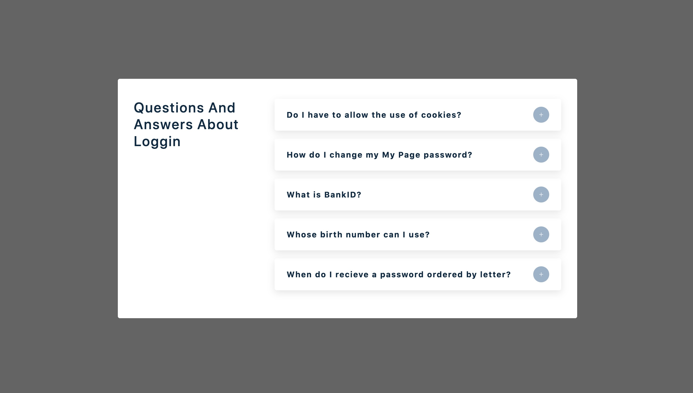
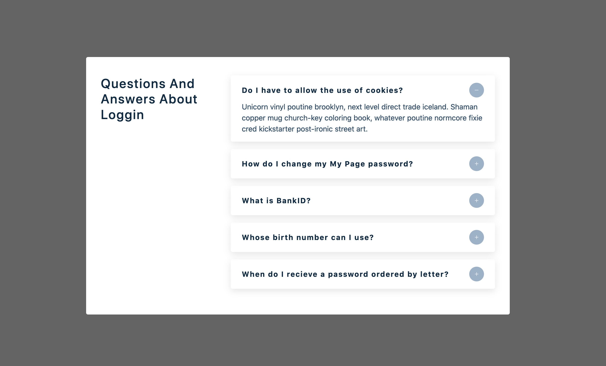

# Question Page created with React JS and JavaScript.

 
 
 

#### This is dynamically created question page with questions and posability to check the answer by using togling

 
 

#### The data used for the questions and their answers are based on a file with objects created by us, who simulate the API.

---

 
 
 

 
 

 
 
 

---

### Enjoy ✨
